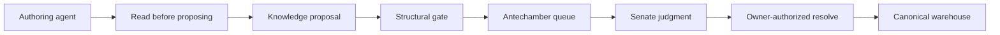
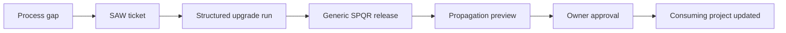

# SPQR v1.5: Sequential Agentic Workflow

SPQR is a structured, owner-orchestrated multi-agent workflow for software delivery. Every agent runs in a fresh session with a narrowly defined role. Durable state does not live in session memory: work moves through repo-native ticket records and append-only handovers, while reusable project knowledge lives in a git-native knowledge warehouse.

The owner starts each stage, closes every major judgment gate, and remains the commit and merge authority. SPQR improves structure, traceability, knowledge reuse, and independent review without automating control away from the human.

---

## What is SPQR?

SPQR separates software work into specialized agent stages. Each stage reconstructs its context from durable sources:

- the ticket definition;
- the project rules;
- the local ticket hub;
- the implementation or research output;
- the append-only handover chain;
- relevant decisions, constraints, and lessons retrieved from the warehouse.

This makes a run auditable, resumable, and resistant to cross-stage contamination.

SPQR provides four project-work pipelines:

- **EXPLORACIO** — research and spikes;
- **OPUS** — feature delivery;
- **CORRECTIO** — defect investigation and correction;
- **RETROACTIO** — cross-run process-health review.

The workflow remains deliberately manual. SPQR does not autonomously start agents, approve decisions, commit code, or merge changes.

---

## The four workflows

### EXPLORACIO — research and spikes

```text
Senate: Consilium → Quaestor → Senate: Censura
```

- **Consilium** frames the question and challenges its premise.
- **Quaestor** researches the problem and produces a structured result.
- **Censura** reviews the result and records the final verdict.
- Reusable findings can be submitted to the knowledge warehouse.

EXPLORACIO answers questions before implementation begins.

### OPUS — feature delivery

```text
Senate: Consilium
    → Praetor
    → Tribunus
    → Probator
    → Curator
    → Senate: Censura
```

- **Consilium** establishes the design and scope.
- **Praetor** implements the approved approach.
- **Tribunus** independently reviews the code.
- **Probator** independently verifies behavior and tests.
- **Curator** checks operational and delivery concerns.
- **Censura** evaluates the completed run and issues the final verdict.

Each stage runs in a fresh session and passes state through the local handover chain.

### CORRECTIO — bug investigation and correction

The default bug flow is intentionally smaller than OPUS:

```text
Praetor: investigate → owner cause-note gate → fix
    → Probator: verify → close
```

Conditional stages enter only when mechanically triggered:

```text
[Tribunus investigator →]
Praetor
[→ Tribunus review]
→ Probator
[→ Curator]
[→ Censura if a new decision was created]
```

Investigation and implementation never collapse into one step. Praetor stops after identifying the root cause, and the owner must approve the cause note before code is written. Probator reproduces the defect before the fix and verifies its absence afterward. Censura is not a standing bug quality gate: it enters only when the fix creates reusable decision knowledge.

### RETROACTIO — process-health review

```text
Retrospector
```

RETROACTIO is a single-agent, owner-initiated review across multiple completed runs. The Retrospector derives trends from existing records:

- Censura verdicts and verdict rounds;
- revision rounds;
- where failures were first caught;
- recurring failure categories;
- warehouse flags and per-node heat;
- repository churn and previous retrospective markers.

It produces narrative trends, not automated scores or pass/fail thresholds. It never modifies code, emits warehouse flags, resolves findings, or creates tickets without owner action.

---

## Agents

| Agent | Equivalent role | Responsibility | Pipelines |
|---|---|---|---|
| Senate: Consilium | Tech Lead / Solution Architect | Challenges the premise, defines scope, and establishes the approved direction | EXPLORACIO, OPUS |
| Senate: Censura | Review authority | Reviews completed work, enforces evidence requirements, judges knowledge proposals, and issues verdicts | EXPLORACIO, OPUS; conditional in CORRECTIO |
| Praetor | Software Engineer | Implements features and investigates/fixes bugs | OPUS, CORRECTIO |
| Tribunus | Senior Engineer / Reviewer | Independently reviews code and may act as a bug investigator | OPUS; conditional in CORRECTIO |
| Probator | QA Engineer | Independently verifies behavior and tests, and closes routine bug fixes | OPUS, CORRECTIO |
| Curator | DevOps / SRE | Reviews operational, deployment, configuration, runtime, and delivery risks | OPUS; conditional in CORRECTIO |
| Quaestor | Technical Researcher | Executes spikes, verifies external claims, and synthesizes structured findings | EXPLORACIO |
| Retrospector | Process-health reviewer | Examines trends across runs without participating in ticket delivery | RETROACTIO |

### Deliberation personas

The Senate uses three perspectives in one session:

| Persona | Primary focus |
|---|---|
| `[Name 1]` | Premise validity, first principles, and unnecessary complexity |
| `[Name 2]` | Delivery, scope, and the shortest responsible path |
| `[Name 3]` | Reliability, maintenance, and production risk |

Quaestor may use a project-specific `[Name 4]` research persona. Execution and review agents do not require personas. Persona values are project configuration; they are not hardcoded into the generic workflow.

---

## The Four Laws

Every agent operates under the same four laws, in priority order:

1. **Stay in Character** — remain inside the active role and pipeline stage.
2. **Anti Meeseeks** — complete pre-flight and stop at required owner gates.
3. **Don't Be Dory** — durable external records are the truth; session memory is not.
4. **Be Like Spock** — form an independent view and suppress no relevant finding.

These laws apply across delivery, research, review, maintenance, and retrospective work.

---

## How work state flows

Each ticket has a repo-native work record:

```text
Ticket definition
      ↓
Ticket hub
      ↓
Output document
      ↓
Append-only handover chain
      ↓
Next fresh agent session
```

The ticket system defines what must be done. The repository records what happened.

A typical ticket record contains:

- a ticket hub with identity and session information;
- an implementation, research, or investigation output;
- optional revision outputs;
- an append-only handover chain;
- verification receipts;
- warehouse trace references.

Agents may read ticket definitions from Notion, Linear, GitHub Issues, Jira, or another tracker. The inter-agent work trace remains in the repository rather than in ticket comments.

---

## Evidence, handovers, and independent review

Claims about verification must carry evidence. Build, test, lint, and warehouse-write claims use a compact receipt containing the decisive verbatim tool output:

```text
receipt: test-command → Executed 42 tests, 0 failures
```

The handover also carries an immutable warehouse trace pointer when the stage queried or wrote through the warehouse.

This produces a clear separation:

- the output document contains implementation or research detail;
- the handover contains routing, verdict, evidence, and trace handles;
- the warehouse contains reusable cross-ticket knowledge.

Censura enforces receipt presence but does not rerun another agent's build or test merely to manufacture missing evidence. Independent review is protected both by fresh sessions and by warehouse retrieval boundaries that hide reasoning lineage from scrutiny agents.

---

## Knowledge Warehouse

SPQR v1.5 replaces monolithic knowledge loading with a git-native knowledge warehouse. Reusable knowledge is stored as small, connected nodes:

- **decision** — a choice future agents must know;
- **constraint** — a rule or limitation future work must respect;
- **lesson** — an observed result worth reusing.

Typed edges connect related knowledge. The store is append-only: history is superseded or resolved through new edges rather than silently rewritten.

### Storage model

- Markdown node files are the canonical source of truth.
- SQLite is a derived, disposable query index.
- The index can be rebuilt from Markdown.
- The warehouse robot never commits or pushes.
- Project knowledge remains owned by the consuming project.

### Query flow

Agents retrieve knowledge in a scoped sequence:

```text
declare intent
    → discover candidates
    → fetch selected bodies
    → traverse relevant relationships
    → record a verdict
```

Agents do not load the entire knowledge base by default. The robot applies per-archetype query policies:

| Archetype | Agents | Purpose |
|---|---|---|
| `deliberate` | Senate | Evaluate decisions and their lineage |
| `execute` | Praetor | Retrieve implementation-relevant knowledge |
| `synthesize` | Quaestor | Combine research and existing knowledge |
| `scrutinize` | Tribunus, Probator, Curator | Review independently without reasoning-chain contamination |
| `consult` | Reserved | Parked for a future strategic advisory role |

The `scrutinize` policy hides reasoning-lineage relationships from independent reviewers. This turns “fresh eyes” from a convention into an enforced retrieval boundary.

### Knowledge ingest

Agents never write canonical warehouse nodes directly.



- A **proposal** is an identity-free knowledge candidate.
- The **hard gate** performs deterministic structural validation.
- The **antechamber** queues valid proposals awaiting judgment.
- The **Senate** evaluates their meaning.
- An **owner-authorized resolve** ingests, rejects, or returns a proposal for revision.

The robot allocates identities. Agents never mint warehouse IDs manually.

### Warehouse maintenance

Warehouse maintenance consists of distinct operations:

```text
audit → flags → retro harvest → owner review → correction → resolution
```

- **Audit** detects structural graph conditions and emits flags.
- **Flags** report issues without modifying the affected node.
- **Heat** is the number of open flags associated with a node.
- **Retro harvest** reads flags and heat as cross-run trends.
- **Flag resolution** closes a handled flag through an explicit write-path action.
- **Semantic audit** is an owner-driven contradiction review, separate from the structural robot audit.
- **Reconcile** rebuilds the disposable SQLite projection from canonical Markdown.

The maintenance model is daemon-free. The owner decides when privileged maintenance runs.

For the detailed contracts, see [`warehouse_robot/docs/`](warehouse_robot/docs/).

---

## Ticket system

Every unit of work maps to a ticket type:

| Type | Purpose | Primary workflow |
|---|---|---|
| **Spike** | Research an unknown and produce a structured result | EXPLORACIO |
| **Feature** | Deliver new functionality | OPUS |
| **Bug** | Investigate and correct a defect | CORRECTIO |
| **Doc** | Maintain workflow or project documentation | Quaestor-driven document flow |

Follow-up ticket creation is owner-gated:

```text
Agent proposes → Censura validates → owner approves → ticket is created
```

Notion is the reference implementation for ticket definition and ticket creation, but the durable work trace is repo-native. Another tracker can be used if its read/create operations are wired into the relevant skills.

---

## Git workflow

SPQR uses GitHub Flow:

- `main` remains the releasable line;
- one short-lived branch is created per ticket;
- OPUS uses `feature/<TICKET-ID>-slug`;
- CORRECTIO uses `fix/<TICKET-ID>-slug`;
- downstream agents continue on the same ticket branch;
- dependent tickets are completed sequentially from `main`;
- agents never commit, merge, push, or tag;
- the owner performs the final commit and merge.

Praetor stops if a matching ticket branch already exists. It never deletes, resets, or resumes that branch without owner direction.

A branch does not protect uncommitted work by itself. Under owner-only commit authority, it becomes an actual history boundary only when the owner commits.

See [`docs/skills/git-workflow.md`](docs/skills/git-workflow.md) for the complete mechanics.

---

## Configuration

SPQR is maintained as a generic source workflow and instantiated into consuming projects. Project-specific values include:

- persona names;
- project paths;
- warehouse root;
- ticket-system configuration;
- project skill references;
- project testing guidance;
- ticket-slicing boundaries.

A consuming project stores its instantiated values and current core version in `spqr.config`. The generic repository keeps placeholders. Propagation re-applies the consuming project's configured values when updating its core workflow files.

Before first use:

1. Review [`docs/CONFIGURE.md`](docs/CONFIGURE.md).
2. Create and fill the project's `spqr.config` from [`spqr.config.template`](spqr.config.template).
3. Instantiate the project rules from [`CLAUDE.md.template`](CLAUDE.md.template).
4. Configure project-specific development, review, and testing skills.
5. Configure the ticket-system integration.
6. Install the warehouse robot and initialize the project warehouse.
7. Verify the required MCP or external tools.
8. Run a workflow and warehouse smoke test.

---

## Dependencies

Core workflow:

- **Claude Code** or a compatible agent runtime;
- **git**;
- a project repository;
- a linkable ticket system.

Knowledge warehouse:

- **Python 3**;
- **SQLite with FTS5 support**;
- a filesystem location for the canonical Markdown warehouse and antechamber.

Optional integrations:

- **Notion MCP** for the reference ticket implementation;
- **Context7 MCP** for current library documentation;
- tracker-specific MCP, API, or CLI integrations.

The durable work record and canonical warehouse do not depend on Notion.

---

## Evolving SPQR

Project delivery and evolution of the workflow are separate processes. The four SPQR workflows operate on project tickets; the upgrade workflow changes SPQR itself.



### Upgrade workflow

A workflow change is developed through a structured upgrade run:

```text
evidence and scope
    → roundtable
    → decisions
    → planning
    → bounded execution
    → verification
    → wrap-up
```

The durable upgrade record lives under `docs/spqr_self/upgrades/<version>/`. This keeps process changes reviewable and prevents cross-file workflow edits from being applied as unrelated patches.

### Propagation

The generic SPQR repository is the source of truth for the reusable workflow core. Updates flow in one direction:

```text
generic SPQR
    → manifest-defined snapshot
    → dry-run and drift detection
    → owner confirmation
    → consuming project
```

Each consuming project keeps its own configuration, warehouse content, project knowledge, and local extensions. Propagation updates only the manifest-defined core surface and never overwrites project-owned knowledge or configuration.

Project insight travels back to generic SPQR through a SAW ticket, not through automatic reverse synchronization.

See:

- [`docs/UPGRADE.md`](docs/UPGRADE.md)
- [`docs/upgrade/propagation-agent.md`](docs/upgrade/propagation-agent.md)
- [`docs/upgrade/propagation-manifest.md`](docs/upgrade/propagation-manifest.md)

---

## Repository structure

```text
.claude/
└── rules/
    └── AGENT_LAWS.md                 shared agent constitution

docs/
├── CONFIGURE.md                      project-configuration reference
├── UPGRADE.md                        upgrade and propagation entry point
│
├── agents/                           live agent definitions
│   ├── senate.md
│   ├── praetor.md
│   ├── tribunus.md
│   ├── probator.md
│   ├── curator.md
│   ├── quaestor.md
│   └── session-starters.md           project-work and warehouse-maintenance starters
│
├── skills/                           stage and cross-pipeline contracts
│   ├── consilium-input.md
│   ├── consilium-discussion.md
│   ├── consilium-output.md
│   ├── censura-input.md
│   ├── censura-discussion.md
│   ├── censura-output.md
│   ├── censura-ticketing-input.md
│   ├── censura-ticketing-discussion.md
│   ├── censura-ticketing-output.md
│   ├── praetor-input.md
│   ├── praetor-discussion.md
│   ├── praetor-output.md
│   ├── praetor-revision.md
│   ├── praetor-impl-doc.md
│   ├── tribunus-input.md
│   ├── tribunus-output.md
│   ├── probator-input.md
│   ├── probator-output.md
│   ├── curator-input.md
│   ├── curator-output.md
│   ├── quaestor-relatio.md
│   ├── quaestor-relatio-output.md
│   ├── quaestor-doc-execute.md
│   ├── debugging-tribunus-input.md
│   ├── bug-pipeline.md               CORRECTIO orchestration
│   ├── git-workflow.md               canonical GitHub Flow mechanics
│   ├── ticket-comment.md             append-only handover and receipt contract
│   ├── ticket-slicing.md
│   ├── collegium-veto.md
│   ├── warehouse-ingest.md           warehouse proposal contract
│   ├── warehouse-usage.md            warehouse owner/agent usage guide
│   └── supporting review and documentation skills
│
├── retro/                            RETROACTIO workflow
│   ├── retrospector.md
│   ├── session-starter.md
│   ├── input.md
│   ├── discussion.md
│   └── output.md
│
├── upgrade/                          generic upgrade and propagation machinery
│   ├── session-starter.md
│   ├── upgrade-agent.md
│   ├── roundtable.md
│   ├── decision-making.md
│   ├── planning.md
│   ├── execution.md
│   ├── context-window.md
│   ├── wrap-up.md
│   ├── propagation-agent.md
│   └── propagation-manifest.md
│
└── spqr_self/                        generic repo's own non-propagated work record
    ├── poc/
    ├── roadmap/
    ├── templates/
    └── upgrades/

warehouse_robot/                      deterministic warehouse package
├── cli.py                            per-call CLI entry surface
├── store.py                          Markdown node codec and physical store
├── schema.py                         disposable SQLite projection schema
├── fold.py                           incremental fold, check, and reconcile
├── query.py                          scoped query and trace protocol
├── policy.py                         archetype budgets and SCRUTINIZE DENY
├── write_gate.py                     proposal gate, antechamber, and ingest
├── audit.py                          structural tripwires, flags, and heat
├── docs/
│   ├── NODE_FORMAT.md
│   ├── QUERY_PROTOCOL.md
│   ├── WRITE_PROTOCOL.md
│   └── AUDIT_PROTOCOL.md
├── fixtures/                         versioned synthetic test data
└── tests/                            robot regression and vertical-slice tests

CLAUDE.md.template                    consuming-project rule template
spqr.config.template                  consuming-project configuration shape
```

The tree shows the active v1.5 workflow and its entry points rather than legacy flat knowledge documents. Canonical project knowledge lives in each consuming project's warehouse; warehouse content is project-owned and is therefore not part of the generic repository tree above.

`docs/spqr_self/` contains the generic repository's own planning and execution record. It is not propagated into consuming projects.

---

## Version history

### v1.5 (2026-06) — Knowledge Warehouse and workflow hardening

- Git-native knowledge warehouse for decisions, constraints, and lessons.
- Deterministic query, write-gate, reconcile, and structural-audit robot.
- Warehouse-primary agent policies and per-archetype retrieval.
- Enforced reasoning-lineage blindness for independent reviewers.
- Proposal → antechamber → Senate judgment → owner-authorized ingest.
- Warehouse trace and write receipts in the handover protocol.
- CORRECTIO lean bug pipeline with investigate-first and an owner cause-note gate.
- Repo-native ticket hub, output, and append-only handover chain.
- Verbatim build, test, lint, and warehouse-write evidence.
- Retrospective detection-health sensors derived without a standing telemetry store.
- GitHub Flow with one branch per ticket and owner-only commit/merge.
- Generic-to-project propagation through a manifest and `spqr.config`.

### v1.3 (2026-06) — Retrospective and process controls

- RETROACTIO pipeline and Retrospector agent.
- Censura convergence gate.
- External-claim verification for research.
- Session ID resumability.
- Token-hygiene and context-loading improvements.

### v1.2.1 (2026-05) — Upgrade workflow

- Structured upgrade agent and supporting roundtable, decision, planning, execution, context, and wrap-up skills.

### v1.2 (2026-05) — Generic workflow and ticketing

- Owner-gated follow-up ticket creation.
- Censura VERIFY and TICKETING phases.
- Generic placeholder configuration.
- DOC-ticket execution support.

### v1.1 (2026-05) — Review and operational foundations

- LESSONS retrospective log.
- Devil's Advocate role.
- Granular tool permissions.
- Sensitive-operation HITL.
- Standalone debugging Tribunus.

### v1.0 (2025)

- Initial sequential agent workflow.

---

## License

MIT
