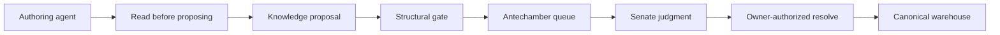
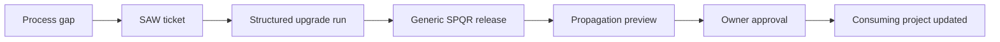

# SPQR v1.5 README Refresh — PoC

## Context / question
The current `README.md` still presents SPQR as **v1.3**. Its hook and much of its content describe the older three-pipeline system: EXPLORACIO/OPUS/RETROACTIO, `LESSONS.md` as the reusable-knowledge sink, project-first generic sync, and a setup model centred on scattered placeholders and Notion configuration.

SPQR v1.5 changes the product-level story across several completed workstreams:

- repo-native ticket hubs, output documents, and append-only handovers;
- GitHub Flow with one branch per ticket and owner-only commit/merge;
- the dedicated **CORRECTIO** bug pipeline;
- verbatim receipts for build/test/lint and warehouse-write claims;
- detection-health signals derived at retro time without a standing telemetry store;
- the git-native Knowledge Warehouse and deterministic robot;
- warehouse-primary agent query and proposal behaviour;
- a defined generic-to-project upgrade/propagation model.

The README is an introductory product document, not an operator manual or delivery record. This PoC settles:

1. what v1.5 concepts belong in the README;
2. how the four project-work pipelines relate to the upgrade workflow;
3. how much warehouse detail is appropriate at README altitude;
4. which current README sections are stale;
5. the target section order and content boundary.

The README will ship with v1.5. It therefore describes the released system and must **not** contain a rollout-status, migration-progress, pending-work, or development-status section.

## Findings

### 1. Product hook
The opening must describe SPQR as an **owner-orchestrated, repo-native, sequential multi-agent workflow**. The durable-state model now has two complementary surfaces:

- the per-ticket work record: hub, output, revisions, append-only handover, receipts, and trace handles;
- the cross-ticket knowledge record: warehouse decisions, constraints, lessons, edges, flags, and query traces.

Recommended hook:

> SPQR is a structured, owner-orchestrated multi-agent workflow for software delivery. Every agent runs in a fresh session with a narrowly defined role. Durable state does not live in session memory: work moves through repo-native ticket records and append-only handovers, while reusable project knowledge lives in a git-native knowledge warehouse.

The opening should also state that the owner starts stages, closes judgment gates, and remains the commit/merge authority. v1.5 improves structure and evidence without turning SPQR into an autonomous orchestrator.

### 2. The project-work model has four pipelines
The README's current "Three pipelines" statement is obsolete. The released model is:

| Pipeline | Purpose | High-level shape |
|---|---|---|
| **EXPLORACIO** | Research / spike | Senate: Consilium → Quaestor → Senate: Censura |
| **OPUS** | Feature delivery | Consilium → Praetor → Tribunus → Probator → Curator → Censura |
| **CORRECTIO** | Bug investigation and correction | Praetor investigate → owner cause-note gate → fix → Probator verify+close, with conditional inserts |
| **RETROACTIO** | Cross-run process-health review | Retrospector, single owner-initiated session |

The spelling should be normalized to **EXPLORACIO**, matching the active agent/skill surface. The current README's `EXPLORATIO` spelling should not survive.

CORRECTIO must be introduced as its own lean flow, not as "Bug fed back into OPUS." README-level facts:

- default two sessions: Praetor and Probator;
- investigation and fix are separated by an explicit owner cause-note gate;
- Tribunus, Curator, and Censura re-enter only on defined triggers;
- Censura is decision-triggered knowledge expansion, not the default bug quality gate.

### 3. Work trace and knowledge must be explained separately
The README should teach this distinction:

```text
Ticket definition
    → local ticket hub
    → output / revision documents
    → append-only handover
    → next fresh session

Relevant project knowledge
    → scoped warehouse query
    → agent judgment
    → optional knowledge proposal
```

The ticket tracker holds the definition and supports owner-gated ticket creation. It does not hold the inter-agent work trace. Notion remains the reference integration, not the owner of machine truth.

### 4. Warehouse coverage belongs in the README
The warehouse changes how every agent consumes and produces reusable knowledge, so it is part of the product identity rather than an internal implementation footnote.

README-level warehouse concepts:

- `decision`, `constraint`, and `lesson` nodes;
- typed relationships between nodes;
- Markdown as canonical truth;
- SQLite as a disposable, rebuildable query projection;
- scoped retrieval instead of monolithic document loading;
- per-archetype query policies;
- structural blindness for independent reviewers;
- proposal → hard gate → antechamber → Senate judgment → owner-authorized ingest;
- audit → flags/heat → retro harvest → owner maintenance;
- append-only evolution rather than silent in-place history edits.

The five query archetypes should be shown only as a compact mapping:

| Archetype | Current consumers | README meaning |
|---|---|---|
| `deliberate` | Senate | May inspect decision lineage |
| `execute` | Praetor | Retrieves implementation-relevant knowledge |
| `synthesize` | Quaestor | Combines research with existing knowledge |
| `scrutinize` | Tribunus, Probator, Curator | Reviews without reasoning-lineage contamination |
| `consult` | None; parked | Reserved for a future strategic/advisor role |

The README should not enumerate budget values, full query verdict vocabularies, CLI syntax, node schema, SQLite tables, proposal-sidecar layout, or ID-allocation mechanics. Those belong in `warehouse_robot/docs/` and the skills.

Suggested ingest diagram:



`flowchart LR` is Mermaid rendering syntax: `flowchart` declares a flow diagram and `LR` means left-to-right. Node identifiers such as `Author` and `Gate` exist only inside the diagram; the bracketed text is the reader-visible label.

### 5. Evidence is now a product-level property
The README should add a short **Evidence, handovers, and independent review** section. It should explain, without reproducing the field contract, that:

- build, test, lint, and warehouse-write claims carry compact verbatim receipts;
- warehouse interactions carry immutable trace handles;
- output documents hold detail while handovers remain terse routing/evidence records;
- Censura enforces evidence presence;
- reviewer independence is supported both by cold sessions and the warehouse SCRUTINIZE DENY.

### 6. Upgrade coverage is relevant but is not a fifth project pipeline
The upgrade process answers a real adoption question: how SPQR itself evolves and how a released generic version reaches a consuming project. It belongs in the README under **Evolving SPQR**, but must remain conceptually separate from EXPLORACIO/OPUS/CORRECTIO/RETROACTIO.

The hierarchy is:

```text
SPQR project-work pipelines
└── execute work inside a consuming project

Upgrade workflow
└── change the generic SPQR system

Propagation
└── bring a consuming project to a released generic version
```

README-level upgrade flow:



The prose should state:

- process findings become SAW tickets;
- an upgrade run follows evidence/scope → roundtable → decisions → planning → bounded execution → verification → wrap-up;
- the durable run record lives under `docs/spqr_self/upgrades/<version>/`;
- the generic SPQR repository is the reusable-workflow source of truth;
- propagation flows one way, generic → project;
- the manifest defines the owned update surface;
- `spqr.config` carries consuming-project values and its core-version stamp;
- propagation previews drift and requires owner confirmation;
- warehouse content, project knowledge, project configuration, and project-owned extensions are not overwritten;
- project insight travels back through a SAW ticket, not reverse synchronization.

This section should link to `docs/UPGRADE.md`, `docs/upgrade/propagation-agent.md`, and `docs/upgrade/propagation-manifest.md` instead of reproducing their operator-level instructions.

Per owner decision, **Evolving SPQR appears immediately before Repository structure**.

### 7. Target README section order

1. `SPQR v1.5: Sequential Agentic Workflow`
2. `What is SPQR?`
3. `The four workflows`
4. `Agents`
5. `The Four Laws`
6. `How work state flows`
7. `Evidence, handovers, and independent review`
8. `Knowledge Warehouse`
9. `Ticket system`
10. `Git workflow`
11. `Configuration`
12. `Dependencies`
13. `Evolving SPQR`
14. `Repository structure`
15. `Version history`
16. `License`

There is deliberately no `Current v1.5 rollout status` section. The README ships with v1.5 and describes the released system, not the upgrade run's intermediate state.

### 8. Staleness inventory

| README surface | Current problem | Required v1.5 update |
|---|---|---|
| Title | Still says v1.3 | Change to v1.5 |
| Product hook | Mentions stateless handovers but not the warehouse | Introduce repo-native work state + git-native knowledge |
| Pipeline count | Says three | Change to four |
| EXPLORACIO spelling | README uses `EXPLORATIO` | Normalize to active `EXPLORACIO` spelling |
| Bug model | Bug is fed back into OPUS | Introduce CORRECTIO |
| Agent table | Praetor/Tribunus/Probator/Curator roles are OPUS-only | Add CORRECTIO responsibilities and triggers |
| Retrospector | General qualitative review only | Add derived detection counters and warehouse flag/heat harvest |
| Ticket model | Tracker and work record are not separated strongly enough | Tracker = definition/creation; repo = work trace |
| Knowledge sink | `LESSONS.md` shown as the active reusable-knowledge sink | Warehouse-primary; legacy physical file is not the active write target |
| Evidence | Receipt rule absent | Add high-level verbatim-evidence discipline |
| Warehouse | Entirely absent | Add query, ingest, independence, and maintenance overview |
| Git | Older mixed branch/worktree story remains | Describe one-ticket GitHub Flow and owner-only commit/merge |
| Configuration | Placeholder-only setup | Introduce `spqr.config` and warehouse root at high level |
| CONFIGURE claim | Described as a complete catalogue | Keep this claim only after the catalogue is reconciled for v1.5 |
| Notion | Presented too centrally | Reframe as reference ticket integration; work record stays local |
| Non-Notion wording | Implies ticket comment writing is required | Remove comment-writing requirement |
| Dependencies | Omits warehouse runtime | Add Python 3 and SQLite/FTS5 |
| Upgrade direction | Says project-first sync / direction under review | Replace with settled generic → project propagation |
| Propagation | Missing | Add Evolving SPQR overview and links |
| Repository tree | Lists v1.3 surface | Add warehouse robot, warehouse-ingest, bug pipeline, git workflow, propagation artifacts, `spqr.config.template` |
| Version history | Stops at v1.3 | Add a concise v1.5 entry |

### 9. Repository structure presentation
**FINAL OWNER DECISION (2026-06-22): retain a detailed repository tree.** The file-level map is useful onboarding material: a new reader can see which concrete agent, skill, retro, upgrade, and warehouse files form the system without first navigating the repo.

The old tree is not preserved verbatim; it is updated to the active v1.5 surface. It should enumerate:

- all live agent definitions + session starters;
- the stage skills and the new cross-pipeline entry points (`bug-pipeline.md`, `git-workflow.md`, `warehouse-ingest.md`, `warehouse-usage.md`, `ticket-comment.md`);
- the RETROACTIO surface;
- the generic upgrade + propagation machinery;
- the generic-only `docs/spqr_self/` record areas;
- the warehouse robot's main modules, protocol docs, fixtures, and tests;
- `CLAUDE.md.template` and `spqr.config.template`.

Legacy flat knowledge documents must **not** be presented as active v1.5 system components. Canonical consuming-project knowledge lives in the warehouse, and warehouse content itself is project-owned rather than part of the generic repository tree.

The target shape is detailed at the useful entry-point level, for example:

```text
.claude/rules/
└── AGENT_LAWS.md

docs/
├── agents/                 named live agent files
├── skills/                 named stage + cross-pipeline skill files
├── retro/                  named RETROACTIO files
├── upgrade/                named upgrade + propagation files
└── spqr_self/              poc / roadmap / templates / upgrades

warehouse_robot/
├── main implementation modules
├── docs/                   NODE / QUERY / WRITE / AUDIT protocols
├── fixtures/
└── tests/

CLAUDE.md.template
spqr.config.template
```

This is intentionally more detailed than a directory-only conceptual map, but it still avoids enumerating every warehouse test or fixture filename and therefore does not become a second propagation manifest.

### 10. Explicit exclusions
The README must not contain:

- a v1.5 rollout/progress/status section;
- pending migration or consuming-project delivery state;
- SAW/D/A decision identifiers as required reader knowledge;
- CLI command catalogues;
- query budget numbers;
- full query verdict vocabularies;
- node frontmatter/schema rules;
- SQLite DDL/table detail;
- proposal sidecar or ID-allocation mechanics;
- audit threshold values;
- internal test counts or delivery receipts;
- Foodoire-specific paths, data, or migration details.

These remain in the run record, PoCs, skills, robot protocol documentation, and consuming-project migration material.

## Recommendation / decision
Replace the current README as a coherent v1.5 product-overview rewrite rather than patching isolated paragraphs.

Adopt the section order recorded in Finding 7. The central narrative is:

```text
owner-orchestrated agents
    + repo-native work trace
    + git-native knowledge warehouse
    + independent evidence-backed review
    + structured generic evolution and propagation
```

The four named pipelines describe project work. **Evolving SPQR** separately explains the generic upgrade and propagation lifecycle and is placed directly before **Repository structure**.

Warehouse coverage stays conceptual: scoped query, gated proposal/ingest, reviewer independence, and flag-driven maintenance. Implementation detail is linked, not duplicated.

**Repository-structure decision (owner-confirmed 2026-06-22):** keep the detailed file tree and update it to v1.5. Include the live agent/skill/retro/upgrade/warehouse entry points; exclude legacy flat knowledge documentation from the active structure.

Do not add `Current v1.5 rollout status` or equivalent transitional content. The README is the released v1.5 introduction and should read as stable product documentation.
